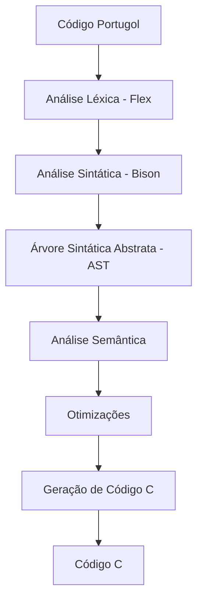

# Visão Geral das Funcionalidades

O Compilador Portugol-C oferece um conjunto abrangente de funcionalidades para tradução de código Portugol para C, mantendo a semântica e funcionalidade originais.

## Arquitetura do Compilador

## Funcionalidades Principais

### 🔍 Análise Léxica (Lexer)
- **Reconhecimento de tokens**: identificadores, números, operadores, palavras-chave
- **Suporte a comentários**: linha (`//`) e bloco (`/* */`)
- **Strings e caracteres**: aspas duplas e simples
- **Números**: inteiros e decimais
- **Operadores especiais**: bitwise, incremento/decremento

### 🌳 Análise Sintática (Parser)
- **Estrutura de programa**: validação da sintaxe Portugol
- **Construção de AST**: árvore sintática abstrata para análise semântica
- **Detecção de erros**: identificação e relatório de erros sintáticos
- **Precedência de operadores**: tratamento correto da precedência

### 🧠 Análise Semântica
- **Tabela de símbolos**: gerenciamento de variáveis e funções
- **Verificação de tipos**: compatibilidade entre tipos de dados
- **Escopo de variáveis**: controle de visibilidade
- **Inicialização**: verificação de variáveis não inicializadas

### ⚡ Otimizações
- **Propagação de constantes**: substituição de expressões por valores constantes
- **Eliminação de código morto**: remoção de código inalcançável
- **Folding de constantes**: avaliação de expressões constantes em tempo de compilação

### 🎯 Geração de Código
- **Tradução direta**: conversão fiel do Portugol para C
- **Formatação**: código C bem formatado e legível
- **Includes automáticos**: adição automática de bibliotecas necessárias

## Recursos Suportados

### ✅ Tipos de Dados
| Portugol | C | Descrição |
|----------|---|-----------|
| `inteiro` | `int` | Números inteiros |
| `real` | `float` | Números de ponto flutuante |
| `caracter` | `char` | Caracteres ASCII |
| `logico` | `bool` | Valores booleanos |

### ✅ Estruturas de Dados
- **Vetores**: Arrays unidimensionais de tamanho fixo
- **Variáveis**: Declaração e inicialização
- **Constantes**: Valores literais

### ✅ Operadores

#### Aritméticos
- `+` (soma)
- `-` (subtração)
- `*` (multiplicação)
- `/` (divisão)
- `%` (módulo)

#### Relacionais
- `==` (igual)
- `!=` (diferente)
- `<` (menor)
- `>` (maior)
- `<=` (menor ou igual)
- `>=` (maior ou igual)

#### Lógicos
- `&&` (E lógico)
- `||` (OU lógico)
- `!` (NÃO lógico)

#### Bitwise
- `&` (E bitwise)
- `|` (OU bitwise)
- `^` (XOR bitwise)
- `~` (NOT bitwise)
- `<<` (shift left)
- `>>` (shift right)

#### Unários
- `++` (incremento)
- `--` (decremento)
- `-` (negação)

### ✅ Estruturas de Controle

#### Condicionais
- `se` / `senao` (if/else)
- `escolha` / `caso` (switch/case)

#### Laços
- `enquanto` (while)
- `para` (for)

#### Controle de Fluxo
- `retorne` (return)
- `pare` (break)

### ✅ Entrada e Saída
- `leia()` - Leitura de dados do usuário
- `escreva()` - Escrita de dados na tela
- Suporte a múltiplos argumentos
- Formatação automática por tipo

### ✅ Funções
- Declaração de funções
- Parâmetros por valor e referência
- Tipos de retorno
- Função principal `inicio()`

## Limitações Conhecidas

### ❌ Não Suportado (ainda)
- Arrays multidimensionais
- Strings como tipo nativo
- Structs/registros
- Ponteiros explícitos
- Alocação dinâmica de memória
- Bibliotecas externas

## Qualidade e Confiabilidade

### 🧪 Sistema de Testes
- **32 casos de teste** automatizados
- **100% de cobertura** das funcionalidades implementadas
- **CI/CD integrado** com GitHub Actions
- **Validação automática** de cada commit

### 📊 Métricas
- **Taxa de sucesso**: 100% nos testes automatizados
- **Tempo de compilação**: < 1s para programas típicos
- **Compatibilidade**: GCC 11.4.0+, Flex 2.6.4+, Bison 3.8.2+

### 🔧 Robustez
- **Tratamento de erros**: Mensagens claras e precisas
- **Recuperação**: Continuação após erros não fatais
- **Validação**: Verificação de entrada em tempo de compilação

## Roadmap Futuro

### 🚀 Próximas Funcionalidades
1. **Strings nativas**: Suporte completo a strings
2. **Arrays multidimensionais**: Matrizes e tensores
3. **Structs**: Tipos de dados compostos
4. **Funções avançadas**: Recursão, sobrecarga
5. **Bibliotecas**: Sistema de módulos

### 🎯 Melhorias Planejadas
1. **Performance**: Otimizações adicionais
2. **Diagnósticos**: Mensagens de erro mais precisas
3. **IDE**: Plugin para editores populares
4. **Debugging**: Geração de informações de debug