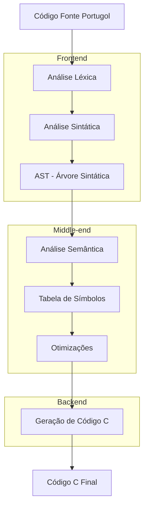

# Arquitetura do Compilador

Esta seção descreve a arquitetura interna do Compilador Portugol-C, suas componentes principais e como elas interagem.

## Visão Geral da Arquitetura



## Componentes Principais

### 📁 Estrutura de Arquivos

```
src/
├── main.c          # Ponto de entrada do compilador
├── lex.l           # Especificação do analisador léxico (Flex)
├── yacc.y          # Especificação do analisador sintático (Bison)
├── ast.h           # Definições da AST
├── ast.c           # Implementação da AST e geração de código
├── simbolos.h      # Definições da tabela de símbolos
├── simbolos.c      # Implementação da tabela de símbolos
└── tipos.h         # Definições de tipos de dados
```

## Frontend - Análise

### 🔍 Análise Léxica (lex.l)

**Responsabilidade**: Converter o código fonte em tokens

**Tecnologia**: Flex (Fast Lexical Analyzer)

**Principais Tokens**:
```c
// Palavras-chave
PROGRAMA, INICIO, FUNCAO, SE, SENAO, ENQUANTO, PARA

// Tipos de dados
TIPO_INTEIRO, TIPO_REAL, TIPO_CARACTER, TIPO_LOGICO

// Operadores
IGUAL, COMPARA, DIFERENTE, SOMA, SUB, MUL, DIV

// Delimitadores
ABRECHAVE, FECHACHAVE, ABREPAR, FECHAPAR

// Literais
NUM, ID, STRING
```

**Funcionalidades**:
- Reconhecimento de números inteiros e decimais
- Suporte a strings e caracteres
- Comentários de linha (`//`) e bloco (`/* */`)
- Operadores bitwise e incremento/decremento

### 🌳 Análise Sintática (yacc.y)

**Responsabilidade**: Validar a estrutura sintática e construir a AST

**Tecnologia**: Bison (GNU Parser Generator)

**Gramática Principal**:
```yacc
programa: PROGRAMA ABRECHAVE corpo_programa FECHACHAVE

corpo_programa: lista_funcoes FUNCAO INICIO ABREPAR FECHAPAR 
                ABRECHAVE bloco FECHACHAVE

declaracao: tipo lista_ids
          | tipo ID ABRECOLCHETE NUM FECHACOLCHETE  // Vetores

expressao: NUM | ID | STRING
         | expressao SOMA expressao
         | ID ABRECOLCHETE expressao FECHACOLCHETE  // Acesso a vetor
```

**Características**:
- Precedência de operadores definida
- Suporte a expressões aninhadas
- Tratamento de conflitos shift/reduce
- Construção incremental da AST

## Middle-end - Semântica e Otimizações

### 🧠 Árvore Sintática Abstrata (AST)

**Arquivo**: `ast.h`, `ast.c`

**Tipos de Nós**:
```c
typedef enum {
    AST_PROGRAMA,           // Raiz do programa
    AST_BLOCO,             // Bloco de comandos
    AST_DECLARACAO,        // Declaração de variável
    AST_VETOR_DECLARACAO,  // Declaração de vetor
    AST_VETOR_ACESSO,      // Acesso a elemento de vetor
    AST_ATRIBUICAO,        // Atribuição
    AST_EXPRESSAO,         // Expressões aritméticas/lógicas
    AST_IF,                // Estrutura condicional
    AST_WHILE,             // Laço while
    AST_FOR,               // Laço for
    AST_LEITURA,           // Comando leia
    AST_ESCRITA,           // Comando escreva
    AST_FUNCAO,            // Declaração de função
    AST_CHAMADA_FUNCAO,    // Chamada de função
    // ... outros tipos
} ASTTipo;
```

**Estrutura do Nó**:
```c
typedef struct AST {
    ASTTipo tipo;           // Tipo do nó
    char* valor;            // Valor literal (se aplicável)
    struct AST** filhos;    // Array de nós filhos
    int n_filhos;           // Número de filhos
    int tipo_expr;          // Tipo da expressão (para análise semântica)
} AST;
```

### 📋 Tabela de Símbolos

**Arquivo**: `simbolos.h`, `simbolos.c`

**Estrutura do Símbolo**:
```c
typedef struct simbolo {
    char nome[32];              // Nome do símbolo
    int tipo;                   // Tipo de dados
    int escopo;                 // Nível de escopo
    CategoriaSimbolo categoria; // Variável, função, parâmetro
    int inicializada;           // Flag de inicialização
    int linha_decl;             // Linha de declaração
    // Para funções:
    int tipo_retorno;           // Tipo de retorno
    int n_parametros;           // Número de parâmetros
    struct simbolo **parametros; // Lista de parâmetros
    struct simbolo *proximo;    // Próximo na hash table
} Simbolo;
```

**Funcionalidades**:
- Hash table para busca eficiente O(1)
- Controle de escopo hierárquico
- Verificação de declaração antes do uso
- Detecção de redefinições
- Análise de tipos

### ⚡ Otimizações

**Propagação de Constantes**:
```c
// Antes da otimização
x = 2 + 3;
y = x * 4;

// Após propagação de constantes
x = 5;
y = 20;
```

**Eliminação de Código Morto**:
```c
// Antes
if (1 == 1) {
    escreva("sempre executado");
    retorne 0;
    x = 10; // <- código morto
}

// Após otimização
escreva("sempre executado");
retorne 0;
```

## Backend - Geração de Código

### 🎯 Geração de Código C

**Arquivo**: `ast.c` (função `ast_gera_c`)

**Estratégia**: Traversal da AST com geração de código correspondente

**Mapeamentos Principais**:

| Portugol | C |
|----------|---|
| `programa { funcao inicio() { ... } }` | `int main() { ... return 0; }` |
| `inteiro x` | `int x;` |
| `real x[5]` | `float x[5];` |
| `leia(x)` | `scanf("%d", &x);` |
| `escreva(x)` | `printf("%d\n", x);` |
| `se (x > 0) { ... }` | `if (x > 0) { ... }` |

**Formatação Automática**:
- Indentação consistente
- Includes automáticos (`#include <stdio.h>`)
- Especificadores de formato corretos (`%d`, `%f`, `%c`)
- Tratamento de referências para scanf

## Fluxo de Compilação

### 🔄 Processo Completo

1. **Inicialização**:
   ```c
   int main() {
       printf("Iniciando o tradutor Portugol → C...\n");
       yyparse();  // Inicia análise sintática
       // ...
   }
   ```

2. **Análise Léxica/Sintática**:
   - Flex gera tokens
   - Bison valida sintaxe
   - AST é construída incrementalmente

3. **Análise Semântica**:
   - Tabela de símbolos é populada
   - Tipos são verificados
   - Escopos são validados

4. **Otimizações**:
   ```c
   raiz_ast = otimiza_ast_propagacao_constantes(raiz_ast);
   raiz_ast = otimiza_ast_dead_code(raiz_ast);
   ```

5. **Geração de Código**:
   ```c
   FILE *saida = fopen("saida.c", "w");
   ast_gera_c(raiz_ast, saida, 0);
   fclose(saida);
   ```

6. **Validação**:
   ```c
   verificar_variaveis();  // Verifica variáveis não inicializadas
   ```

7. **Limpeza**:
   ```c
   ast_libera(raiz_ast);  // Libera memória da AST
   ```

## Tratamento de Erros

### 🚨 Tipos de Erros

1. **Erros Léxicos**:
   ```
   [LEXER] caracter inválido: @
   ```

2. **Erros Sintáticos**:
   ```
   Erro sintático: syntax error
   ```

3. **Erros Semânticos**:
   ```
   [ERRO SEMÂNTICO] Variável 'x' não declarada!
   [ERRO SEMÂNTICO] Função 'foo' espera 2 parâmetros, mas recebeu 1.
   ```

### 🔧 Estratégias de Recuperação

- **Panic mode**: Sincronização em pontos seguros
- **Continuação**: Tentativa de prosseguir após erro
- **Relatórios detalhados**: Linha e contexto do erro

## Performance e Escalabilidade

### 📈 Complexidade

| Componente | Complexidade | Observações |
|------------|-------------|-------------|
| Análise Léxica | O(n) | Linear no tamanho do código |
| Análise Sintática | O(n) | Parser LR(1) |
| Tabela de Símbolos | O(1) | Hash table bem distribuída |
| Geração de Código | O(n) | Traversal simples da AST |

### 💾 Uso de Memória

- **AST**: Proporcional ao tamanho do código
- **Tabela de Símbolos**: Hash table com 211 buckets
- **Buffers**: Strings alocadas dinamicamente
- **Cleanup**: Liberação automática ao final

### ⚡ Otimizações de Performance

- Hash table para símbolos
- Alocação eficiente de nós AST
- Strings com `strdup()` para flexibilidade
- Verificações preguiçosas onde possível

## Extensibilidade

### 🔌 Pontos de Extensão

1. **Novos Tipos**: Adicionar em `tipos.h` e `simbolos.c`
2. **Novos Operadores**: Extender `lex.l` e `yacc.y`
3. **Novas Estruturas**: Adicionar tipos AST e geração correspondente
4. **Otimizações**: Implementar novos passes de otimização

### 📐 Padrões de Design

- **Visitor Pattern**: Para traversal da AST
- **Strategy Pattern**: Para diferentes tipos de otimização
- **Factory Pattern**: Para criação de nós AST
- **Observer Pattern**: Para relatório de erros
