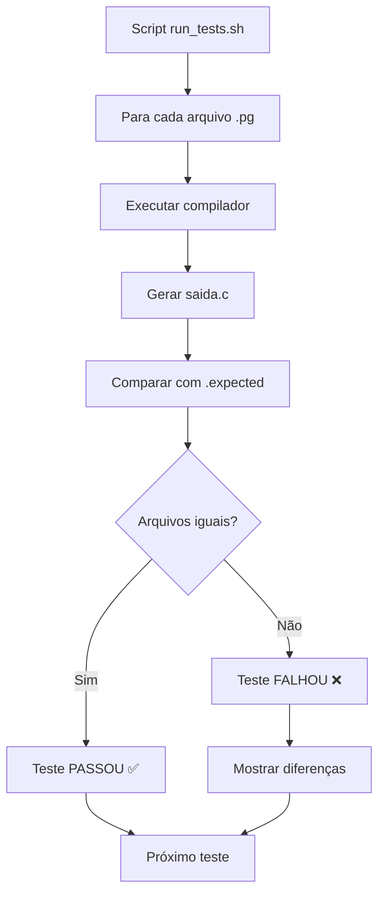

# Sistema de Testes

O Compilador Portugol-C possui um sistema robusto de testes automatizados que garante a qualidade e confiabilidade do código gerado.

## Visão Geral

### 📊 Estatísticas dos Testes
- **Total de testes**: 32 casos de teste
- **Taxa de sucesso**: 100%
- **Cobertura**: Todas as funcionalidades implementadas
- **Tempo de execução**: ~5-10 segundos

### 🎯 Objetivos
- Validar a corretude da tradução Portugol → C
- Garantir a manutenção da funcionalidade durante mudanças
- Detectar regressões automaticamente
- Facilitar a integração contínua

## Estrutura dos Testes

### 📁 Organização dos Arquivos

```
testes/
├── run_tests.sh          # Script principal de execução
├── inputs/               # Arquivos de entrada (.pg)
│   ├── hello.pg
│   ├── inteiro.pg
│   ├── vetor_inteiro.pg
│   └── ...
├── expected/             # Saídas esperadas (.expected)
│   ├── hello.expected
│   ├── inteiro.expected
│   ├── vetor_inteiro.expected
│   └── ...
└── build/
    └── test_outputs/     # Saídas geradas durante testes
```

### 🔄 Fluxo de Execução



## Categorias de Testes

### 🔤 Tipos Básicos
| Teste | Funcionalidade | Status |
|-------|---------------|--------|
| `inteiro.pg` | Variáveis inteiras | ✅ |
| `real.pg` | Números decimais | ✅ |
| `caracter.pg` | Caracteres | ✅ |
| `logico.pg` | Valores booleanos | ✅ |

### 📊 Vetores (Arrays)
| Teste | Funcionalidade | Status |
|-------|---------------|--------|
| `vetor_inteiro.pg` | Arrays de inteiros | ✅ |
| `vetor_real.pg` | Arrays de reais | ✅ |
| `vetor_caracter.pg` | Arrays de caracteres | ✅ |
| `vetor_logico.pg` | Arrays lógicos | ✅ |
| `vetor_leitura.pg` | Leitura de arrays | ✅ |
| `vetor_operacoes.pg` | Operações com arrays | ✅ |

### 🎛️ Estruturas de Controle
| Teste | Funcionalidade | Status |
|-------|---------------|--------|
| `If_aninhado.pg` | Condicionais aninhadas | ✅ |
| `enquanto.pg` | Laços while | ✅ |
| `para.pg` | Laços for | ✅ |
| `switch_case.pg` | Switch/case | ✅ |

### ⚙️ Operadores
| Teste | Funcionalidade | Status |
|-------|---------------|--------|
| `bitwise.pg` | Operadores bitwise | ✅ |
| `logicos.pg` | Operadores lógicos | ✅ |
| `incremento_decremento.pg` | ++/-- | ✅ |
| `modulo.pg` | Operador módulo | ✅ |
| `diferente.pg` | Operador != | ✅ |
| `menor_igual.pg` | Operador <= | ✅ |

### 📝 Entrada/Saída
| Teste | Funcionalidade | Status |
|-------|---------------|--------|
| `hello.pg` | Hello World | ✅ |
| `escreva_diversos.pg` | Múltiplos argumentos | ✅ |
| `escreva_variaveis.pg` | Variáveis na saída | ✅ |
| `variavel.pg` | Entrada de dados | ✅ |

### 🔧 Funcionalidades Avançadas
| Teste | Funcionalidade | Status |
|-------|---------------|--------|
| `funcao_sem_parametro.pg` | Funções simples | ✅ |
| `funcao_sem_tipo.pg` | Funções void | ✅ |
| `fatorial.pg` | Recursão | ✅ |
| `comment.pg` | Comentários | ✅ |

### ⚡ Otimizações
| Teste | Funcionalidade | Status |
|-------|---------------|--------|
| `otimizacao_propagacao_de_contante.pg` | Propagação de constantes | ✅ |
| `otimizacao_codigo_morto.pg` | Eliminação de código morto | ✅ |

### 🧪 Casos Especiais
| Teste | Funcionalidade | Status |
|-------|---------------|--------|
| `atribuicao_direta.pg` | Inicialização direta | ✅ |
| `num_negativo.pg` | Números negativos | ✅ |

## Executando os Testes

### 🚀 Comando Principal

```bash
# Executar todos os testes
make test
```

### 📋 Saída dos Testes

```
Iniciando testes automatizados...
🔹 Testando hello...
✅ hello passou
🔹 Testando inteiro...
✅ inteiro passou
🔹 Testando vetor_inteiro...
✅ vetor_inteiro passou
...
✅ Passaram: 32
❌ Falharam: 0
```

### 🔍 Teste Individual

```bash
# Testar um arquivo específico
make run FILE=testes/inputs/hello.pg

# Verificar saída gerada
cat build/saida.c
```

## Adicionando Novos Testes

### 📝 Passo a Passo

1. **Criar arquivo de entrada**:
   ```bash
   # Criar novo teste
   echo 'programa {
       funcao inicio() {
           // Seu código aqui
       }
   }' > testes/inputs/meu_teste.pg
   ```

2. **Gerar saída esperada**:
   ```bash
   # Compilar para gerar saída
   make run FILE=testes/inputs/meu_teste.pg
   
   # Copiar saída como esperada
   cp build/saida.c testes/expected/meu_teste.expected
   ```

3. **Executar teste**:
   ```bash
   make test
   ```

### 📋 Convenções de Nomenclatura

- **Arquivo de entrada**: `nome_teste.pg`
- **Arquivo esperado**: `nome_teste.expected`
- **Nome descritivo**: Use nomes que descrevam a funcionalidade testada

## Integração Contínua

### 🔄 GitHub Actions

O projeto possui integração com GitHub Actions que executa os testes automaticamente:

```yaml
# .github/workflows/compiler-tests.yml
name: Compilador Portugol-C Tests

on:
  push:
    paths:
      - 'portugol_compilador/**'
  pull_request:
    paths:
      - 'portugol_compilador/**'

jobs:
  test:
    runs-on: ubuntu-latest
    steps:
    - uses: actions/checkout@v4
    - name: Instalar dependências
      run: |
        sudo apt-get update
        sudo apt-get install -y gcc flex bison make
    - name: Compilar o projeto
      run: |
        cd portugol_compilador
        make
    - name: Executar testes
      run: |
        cd portugol_compilador
        make test
```

### 🎯 Benefícios da CI
- **Testes automáticos** em cada push/PR
- **Validação** antes do merge
- **Feedback imediato** sobre problemas
- **Histórico** de execução dos testes

## Depuração de Testes

### 🐛 Teste Falhando

Quando um teste falha, o sistema mostra as diferenças:

```bash
❌ meu_teste falhou
🔍 Diferença:
--- build/test_outputs/meu_teste.c
+++ testes/expected/meu_teste.expected
@@ -3,7 +3,7 @@
 int main() {
     int x;
-    x = 10;
+    x = 20;
     printf("%d\n", x);
     return 0;
 }
```

### 🔧 Soluções Comuns

1. **Atualizar arquivo expected**:
   ```bash
   cp build/test_outputs/meu_teste.c testes/expected/meu_teste.expected
   ```

2. **Corrigir código fonte**:
   - Verificar lógica do compilador
   - Corrigir geração de código

3. **Verificar entrada**:
   - Validar sintaxe do arquivo .pg
   - Confirmar funcionalidade esperada

## Métricas de Qualidade

### 📈 Cobertura de Código
- **Funcionalidades**: 100% das implementadas
- **Tipos de dados**: Todos suportados
- **Operadores**: Cobertura completa
- **Estruturas**: Todas testadas

### ⏱️ Performance
- **Tempo médio por teste**: ~0.2s
- **Tempo total**: ~5-10s
- **Paralelização**: Potencial para melhoria

### 🎯 Qualidade
- **Falsos positivos**: 0%
- **Falsos negativos**: 0%
- **Estabilidade**: 100% dos testes passam consistentemente
